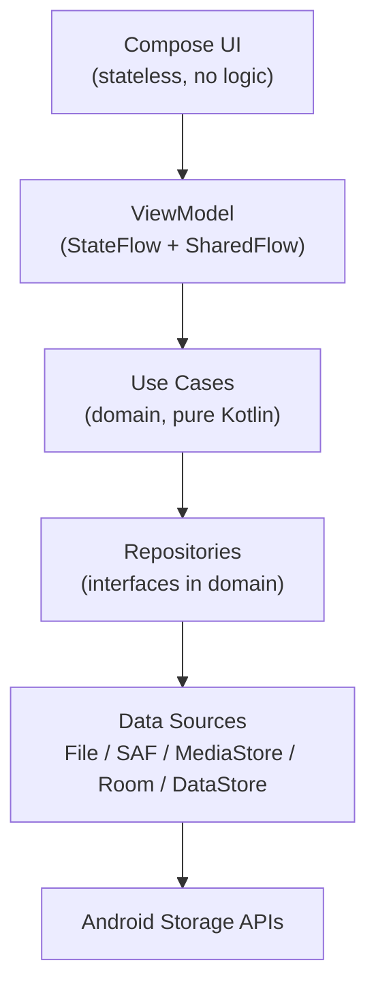

# Refract — Android File Manager

> **Read this file first.** It is the master context document for any AI coding agent or
> engineer working on this project. Every claim here is expanded in a linked document.
> If this file and a linked document disagree, the linked document wins and this file
> should be corrected.

**Working name:** Refract
**Application ID:** `com.devbehindyou.refract` (change before first release if the brand differs)
**Platform:** Android, native
**Language:** Kotlin only
**UI:** Jetpack Compose + Material 3
**minSdk:** 27 (Android 8.1)
**compileSdk / targetSdk:** 36 (Android 16) — required by Google Play for new submissions from 31 Aug 2026
**Architecture:** MVVM + Clean-lite (UI → ViewModel → UseCase → Repository → DataSource)

---

## 1. Product vision

A file manager that a beginner can open and immediately understand, and that a power user
never outgrows. It looks like nothing else on Android because its chrome is built from a
custom **Liquid Glass** rendering system that refracts the content behind it rather than
merely blurring it — but the glass is confined to navigation and interactive surfaces, and
it degrades cleanly on every device down to Android 8.1.

**One sentence:** *Simple by default, powerful when needed, and never unsafe with your files.*

## 2. Non-negotiable engineering priority order

```text
1. File safety            — never lose or corrupt user data
2. Reliability            — never crash, never leave an operation half-done silently
3. Correct storage behaviour — obey Scoped Storage, SAF, and Play policy honestly
4. Performance            — 60fps scroll, instant folder open
5. Accessibility          — TalkBack, contrast, reduced motion/transparency
6. Usability              — discoverable, low-friction
7. Visual polish          — spacing, type, motion
8. Advanced visual effects — shaders, refraction, highlights
```

Anything in 7–8 that threatens 1–4 is deleted, not optimised. This ordering is enforced in
code review and in [`AI_DEVELOPMENT_GUIDE.md`](AI_DEVELOPMENT_GUIDE.md).

## 3. The three hard Android truths this project is built around

These are researched in [`ANDROID_STORAGE_RESEARCH.md`](ANDROID_STORAGE_RESEARCH.md).
Ignoring any one of them produces an app that fails review or fails on device.

1. **There is no single storage API that works across API 27–37.** Legacy `File` I/O works
   on 27–28, is fenced by Scoped Storage from 29, and from 30 requires either
   `MANAGE_EXTERNAL_STORAGE` or SAF. The app therefore has **three storage backends behind
   one interface**, selected at runtime.
2. **`MANAGE_EXTERNAL_STORAGE` does not grant unlimited access.** Even when granted, on API
   30+ the app cannot write into `/Android/data` or `/Android/obb`, and access to those
   paths via SAF is blocked from API 30 (fully from API 33 the picker refuses those trees).
   Any UI implying "full access" is a lie and a support burden.
3. **Blur is not free and not universal.** True background sampling requires `RuntimeShader`
   (API 33+). API 32 can approximate with layered `GraphicsLayer`s. API 31 has
   `RenderEffect` but with known artefacts. Below that, only scrims and gradients.
   Hence the three-tier renderer in [`LIQUID_GLASS_RESEARCH.md`](LIQUID_GLASS_RESEARCH.md).

## 4. Architecture at a glance



* Domain layer is pure Kotlin — no `android.*` imports, no `java.io.File` leaking upward.
* Every file, wherever it lives, is a **`FileNode`** — see
  [`architecture/STORAGE_ARCHITECTURE.md`](architecture/STORAGE_ARCHITECTURE.md).
* Every mutation goes through the **File Operations Engine** — see
  [`architecture/FILE_OPERATIONS.md`](architecture/FILE_OPERATIONS.md).
* Every permission request goes through **`StorageAccessManager`** — see
  [`architecture/PERMISSIONS.md`](architecture/PERMISSIONS.md).

## 5. Module structure

Single Gradle module for MVP (`:app`), with **package-level enforcement** of the same
boundaries. Modularisation is deferred to V1 and justified in
[`architecture/MODULES.md`](architecture/MODULES.md). Do not create fifteen Gradle modules
before there is a build-time reason to.

```text
com.devbehindyou.refract
├── core.designsystem     // tokens, theme, glass renderer
├── core.ui               // shared composables, previews
├── core.common           // Result types, dispatchers, extensions
├── core.database         // Room entities, DAOs
├── core.datastore        // preferences
├── domain                // models, repository interfaces, use cases  (NO android.*)
├── data                  // repository impls, storage backends, mappers
└── feature.{home,browse,search,storage,preview,operations,settings,permissions}
```

## 6. Design system and Liquid Glass

* All visual values come from semantic tokens. No hard-coded `dp`, colour, or blur radius
  anywhere in feature code — [`DESIGN_SYSTEM.md`](DESIGN_SYSTEM.md).
* Glass appears on: bottom bar, search bar, toolbars, sheets, dialogs, context menus,
  selection bar, FAB. **Not** on list rows, not on backgrounds, not on text containers.
* `GlassCapabilityManager` resolves a `GlassTier` (A / B / C) from API level, GPU class,
  RAM, thermal status, battery saver, and accessibility settings, and all glass composables
  read it — [`LIQUID_GLASS_RESEARCH.md`](LIQUID_GLASS_RESEARCH.md).
* Layout, hit targets, and information hierarchy are **identical across tiers**. Only the
  material changes.

## 7. Major features by release

| | MVP | V1 | Future |
|---|---|---|---|
| Browse internal + SD | ✅ | | |
| Copy / move / rename / delete / share | ✅ | | |
| Search (current tree + MediaStore) | ✅ | | |
| Categories, Recents, Favourites | ✅ | | |
| Storage overview | ✅ | | |
| Image / video / audio / text preview | ✅ | | |
| ZIP create + extract | ✅ | | |
| Indexed search (Room) | | ✅ | |
| Duplicate finder, large files, empty folders | | ✅ | |
| Command palette, operation queue UI, undo | | ✅ | |
| USB OTG, dual pane tablets, drag & drop | | ✅ | |
| PDF preview, APK metadata, checksums | | ✅ | |
| 7z / TAR, cloud providers, root, FTP | | | ✅ |
| On-device AI (opt-in, local only) | | | ✅ |

Full breakdown with acceptance criteria: [`roadmap/MVP.md`](roadmap/MVP.md),
[`roadmap/V1.md`](roadmap/V1.md), [`roadmap/FUTURE.md`](roadmap/FUTURE.md).

## 8. Development rules (summary — full list in CODING_RULES.md)

1. Kotlin only. Compose only. No XML layouts, no Fragments beyond the single Activity.
2. No business logic in a `@Composable`. Composables take state + lambdas.
3. UI state is an immutable `data class`; events are a sealed interface.
4. ViewModels never touch `java.io.File`, `ContentResolver`, or `DocumentFile`.
5. No disk I/O on the main thread, ever. `Dispatchers.IO` + `withContext`.
6. Streaming I/O only. Never `readBytes()` on a user file.
7. Every destructive action is confirmed, reversible, or both.
8. Every dependency must be justified in [`TECH_STACK.md`](TECH_STACK.md).
9. Accessibility is written at the same time as the composable, not after.
10. Guard every API-level-gated call with a documented constant, never a raw integer.

## 9. Document index

### Product
| File | Contents |
|---|---|
| [`PRODUCT_CONTEXT.md`](PRODUCT_CONTEXT.md) | Market, users, competitors, positioning |
| [`PRODUCT_SCOPE.md`](PRODUCT_SCOPE.md) | In scope, out of scope, explicit non-goals |
| [`PRODUCT_REQUIREMENTS.md`](PRODUCT_REQUIREMENTS.md) | PRD, personas, jobs to be done |
| [`FUNCTIONAL_REQUIREMENTS.md`](FUNCTIONAL_REQUIREMENTS.md) | Numbered FRs, testable |
| [`NON_FUNCTIONAL_REQUIREMENTS.md`](NON_FUNCTIONAL_REQUIREMENTS.md) | Perf, reliability, budgets |
| [`PRIVACY.md`](PRIVACY.md) | Local-first policy, data map |

### Research
| File | Contents |
|---|---|
| [`ANDROID_STORAGE_RESEARCH.md`](ANDROID_STORAGE_RESEARCH.md) | API 27→37 storage matrix, primary sources |
| [`LIQUID_GLASS_RESEARCH.md`](LIQUID_GLASS_RESEARCH.md) | Apple principles, Android reality, 3-tier renderer |
| [`TECH_STACK.md`](TECH_STACK.md) | Every dependency with justification |

### Design
| File | Contents |
|---|---|
| [`UI_UX_GUIDELINES.md`](UI_UX_GUIDELINES.md) | Interaction principles, IA, glass usage rules |
| [`DESIGN_SYSTEM.md`](DESIGN_SYSTEM.md) | Colour, type, shape, spacing, elevation, glass tokens |
| [`COMPONENT_LIBRARY.md`](COMPONENT_LIBRARY.md) | Every reusable composable, states, a11y |
| [`ANIMATION_SYSTEM.md`](ANIMATION_SYSTEM.md) | Motion language, springs, durations |
| [`ACCESSIBILITY.md`](ACCESSIBILITY.md) | TalkBack, contrast, reduce motion/transparency |
| [`RESPONSIVE_DESIGN.md`](RESPONSIVE_DESIGN.md) | Phone, foldable, tablet, desktop windows |

### Architecture
| File | Contents |
|---|---|
| [`architecture/ARCHITECTURE.md`](architecture/ARCHITECTURE.md) | Layers, boundaries, DI graph |
| [`architecture/MVVM.md`](architecture/MVVM.md) | Every ViewModel, state, events, effects |
| [`architecture/MODULES.md`](architecture/MODULES.md) | Module plan and when to split |
| [`architecture/DOMAIN_LAYER.md`](architecture/DOMAIN_LAYER.md) | Models and use cases |
| [`architecture/DATA_LAYER.md`](architecture/DATA_LAYER.md) | Repositories, backends, Room schema |
| [`architecture/UI_LAYER.md`](architecture/UI_LAYER.md) | Compose structure, state hoisting, perf |
| [`architecture/STORAGE_ARCHITECTURE.md`](architecture/STORAGE_ARCHITECTURE.md) | `FileNode`, backend selection |
| [`architecture/FILE_OPERATIONS.md`](architecture/FILE_OPERATIONS.md) | Queue, executor, collisions, cancellation |
| [`architecture/SEARCH_ARCHITECTURE.md`](architecture/SEARCH_ARCHITECTURE.md) | Three-source search, index |
| [`architecture/PERMISSIONS.md`](architecture/PERMISSIONS.md) | Per-API flows, Play declaration |
| [`architecture/SECURITY.md`](architecture/SECURITY.md) | Zip Slip, FileProvider, intents, APKs |
| [`architecture/PERFORMANCE.md`](architecture/PERFORMANCE.md) | Budgets and how they are measured |
| [`architecture/NAVIGATION.md`](architecture/NAVIGATION.md) | Graph, deep links, predictive back |
| [`ERROR_MODEL.md`](ERROR_MODEL.md) | `FileError` taxonomy → user messages |
| [`LOGGING_DIAGNOSTICS.md`](LOGGING_DIAGNOSTICS.md) | Structured logs, operation IDs, redaction |

### Diagrams
`architecture/system-architecture.md`, `data-flow.md`, `module-dependencies.md`,
`navigation-flow.md`, `storage-flow.md`, `file-operation-flow.md`, `permission-flow.md`
and the seven DFDs under [`dfd/`](dfd/).

### Screens
[`screens/SCREEN_INDEX.md`](screens/SCREEN_INDEX.md) covers all 25 screens; the seven
highest-complexity screens have dedicated files.

### Engineering process
| File | Contents |
|---|---|
| [`CODING_RULES.md`](CODING_RULES.md) | Hard rules with rationale |
| [`AI_DEVELOPMENT_GUIDE.md`](AI_DEVELOPMENT_GUIDE.md) | How AI Studio must work on this repo |
| [`testing/TEST_STRATEGY.md`](testing/TEST_STRATEGY.md) | What is tested and how |
| [`testing/DEVICE_MATRIX.md`](testing/DEVICE_MATRIX.md) | API 27→37 device/emulator grid |
| [`roadmap/`](roadmap/) | Phased plan with acceptance criteria |

## 10. Where to start coding

Do **not** start at the UI. Start at Phase 1 in
[`roadmap/IMPLEMENTATION_ROADMAP.md`](roadmap/IMPLEMENTATION_ROADMAP.md):
project skeleton → `FileNode` + backends → browse → operations. The glass system is
**Phase 8**, deliberately late, and it must be droppable without touching feature code.
