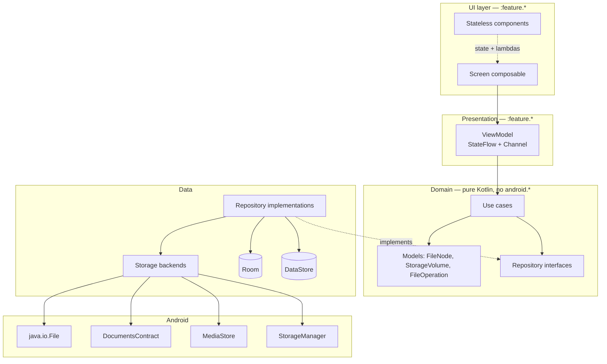

# Architecture

## 1. Shape

MVVM with Clean-Architecture *principles*, not Clean-Architecture ceremony.



**Dependency rule:** arrows point inward only. `domain` depends on nothing but Kotlin and
coroutines. This is enforced by a custom Lint rule that fails the build on any `android.*`
or `java.io.File` import inside the `domain` package.

## 2. Layer responsibilities

| Layer | Owns | Must never |
|---|---|---|
| **UI** | Layout, theming, animation, semantics | Contain business logic, touch a repository, hold mutable business state |
| **ViewModel** | UI state assembly, event handling, `viewModelScope` orchestration | Import `java.io.File`, `ContentResolver`, `DocumentFile`, or `Uri` handling logic |
| **Use case** | One business operation, composed from repositories, testable in isolation | Know about Compose, know about Android |
| **Repository** | Choosing a backend, caching, mapping platform types → domain models | Leak `Cursor`, `DocumentFile`, or `File` upward |
| **Backend** | Talking to exactly one storage mechanism | Make product decisions (e.g. what to do on a collision) |

**A use case is only created when it does real work.** A use case that calls exactly one
repository method and returns is boilerplate — the ViewModel calls the repository directly.
Use cases exist for: `CopyFilesUseCase`, `SearchFilesUseCase`, `AnalyseStorageUseCase`,
`FindDuplicatesUseCase`, `ExtractArchiveUseCase`, `DeleteFilesUseCase`,
`ResolveStorageAccessUseCase`, `ObserveDirectoryUseCase`.

## 3. Threading model

| Work | Dispatcher |
|---|---|
| All disk and `ContentResolver` I/O | `Dispatchers.IO` (injected as `@IoDispatcher`) |
| Sorting, hashing, filtering large lists | `Dispatchers.Default` |
| UI state mapping | Whatever `viewModelScope` gives (Main.immediate), because it must be trivial |

Rules:
* Dispatchers are always injected, never referenced statically — tests substitute
  `UnconfinedTestDispatcher`.
* No `runBlocking` outside tests (Lint-enforced).
* No `GlobalScope`. Operation work uses a service-scoped `CoroutineScope` with a
  `SupervisorJob`.
* Every `Flow` from the data layer is cold and `.flowOn(io)`.

## 4. State and event contract

```kotlin
interface UiState                                   // immutable data class per screen
interface UiEvent                                   // sealed interface, user intents
interface UiEffect                                  // sealed interface, one-shot

abstract class BaseViewModel<S : UiState, E : UiEvent, F : UiEffect> {
    val state: StateFlow<S>
    private val _effects = Channel<F>(Channel.BUFFERED)
    val effects: Flow<F> = _effects.receiveAsFlow()
    abstract fun onEvent(event: E)
}
```

* **State** is what the screen looks like. `StateFlow`, always has a value, survives config
  change, restored from `SavedStateHandle` for the parts that matter (path, query, selection).
* **Effects** are things that happen once: show a snackbar, launch an `Intent`, navigate.
  A `Channel`, not a `SharedFlow` — effects must not be lost or duplicated on recomposition.
* The screen collects with `collectAsStateWithLifecycle()`, effects with a
  `LaunchedEffect` + `flowWithLifecycle`.

## 5. Result and error handling

```kotlin
sealed interface FileResult<out T> {
    data class Success<T>(val value: T) : FileResult<T>
    data class Failure(val error: FileError) : FileResult<Nothing>
}
```

* The data layer **never throws** across its boundary. Platform exceptions
  (`SecurityException`, `IOException`, `FileNotFoundException`, `ErrnoException`) are caught
  at the backend edge and mapped to a `FileError`.
* `FileError` is a domain sealed interface — see `../ERROR_MODEL.md`.
* The UI layer never sees an exception type or a message string from the platform.

## 6. Dependency injection

Hilt, with these components:

| Scope | Contains |
|---|---|
| `SingletonComponent` | Repositories, Room, DataStore, `GlassCapabilityManager`, `StorageAccessManager`, dispatchers, the operation queue |
| `ActivityRetainedComponent` | Nothing today; reserved |
| `ViewModelComponent` | Use cases |
| `ServiceComponent` | `FileOperationExecutor`, its `CoroutineScope` |

The three storage backends are bound into a map and selected at runtime by
`StorageBackendSelector`, not by constructor injection of a single backend:

```kotlin
@Binds @IntoMap @BackendKey(BackendType.FILE)       fun fs(impl: FileSystemBackend): StorageBackend
@Binds @IntoMap @BackendKey(BackendType.SAF)        fun saf(impl: SafBackend): StorageBackend
@Binds @IntoMap @BackendKey(BackendType.MEDIASTORE) fun ms(impl: MediaStoreBackend): StorageBackend
```

## 7. Process death and state restoration

| State | Restored from |
|---|---|
| Current path / route | `SavedStateHandle` via type-safe nav args |
| Scroll position | `rememberLazyListState` + `SavedStateHandle` for the folder key |
| Selection | `SavedStateHandle` (list of node ids, capped at 500; beyond that, cleared with a message) |
| Search query and filters | `SavedStateHandle` |
| Running operations | Room (`operation` table) + the foreground service; the service is `START_REDELIVER_INTENT` and rebuilds its queue from Room on restart |
| Glass tier | Recomputed, never restored |

Process-death behaviour is a **tested requirement**, not an aspiration — see
`../testing/TEST_STRATEGY.md` §6.

## 8. Why not more layers

Rejected: separate `:domain` Gradle module at MVP, a `Mapper` class per model, a
`DataSource` interface per backend per operation, and UseCase-per-repository-method.
Each adds indirection without adding a seam we actually need. The seams we do need are:
storage backend, repository, and dispatcher — and all three are injectable and fakeable.

Revisit when: build times exceed 90 s incremental, or a second app surface (Wear, TV,
a widget) needs to share the domain.
