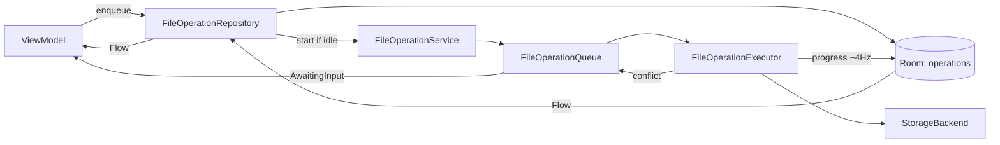

> Verification update (13 September 2026): file copies now stage output, verify SHA-256 and length, then publish before source deletion. Destination backups protect failed overwrites within the running process. This is not a persistent transaction journal; process-death recovery remains unverified. See [App verification](../testing/VERIFICATION_REPORT.md).

# File Operations Engine

This is the part of the app where bugs destroy user data. It gets the most defensive design
and the most tests.

---

## 1. Model

```kotlin
data class FileOperation(
    val id: OperationId,                 // UUID, used in every log line
    val type: OperationType,             // COPY, MOVE, DELETE, RENAME, EXTRACT, COMPRESS
    val sources: List<FileNodeId>,
    val destination: FileNodeId?,        // null for delete/rename
    val options: OperationOptions,
    val createdAt: Long,
)

data class OperationOptions(
    val collisionPolicy: CollisionPolicy = CollisionPolicy.ASK,
    val deleteSourceAfterCopy: Boolean = false,   // move implemented as copy+delete when needed
    val preserveTimestamps: Boolean = true,
    val useTrash: Boolean = true,
    val compressionLevel: Int? = null,
)

enum class CollisionPolicy { ASK, OVERWRITE, KEEP_BOTH, SKIP, RENAME_AUTO }

sealed interface OperationStatus {
    data object Queued : OperationStatus
    data class Running(val progress: OperationProgress) : OperationStatus
    data class Paused(val progress: OperationProgress) : OperationStatus
    data class AwaitingInput(val conflict: Conflict) : OperationStatus
    data class Completed(val summary: OperationSummary) : OperationStatus
    data class PartiallyCompleted(val summary: OperationSummary) : OperationStatus
    data class Failed(val error: FileError, val summary: OperationSummary) : OperationStatus
    data object Cancelled : OperationStatus
}

data class OperationProgress(
    val itemsDone: Int, val itemsTotal: Int,
    val bytesDone: Long, val bytesTotal: Long,
    val currentName: String?,
    val bytesPerSecond: Long,
    val etaMillis: Long?,
)

data class OperationSummary(
    val succeeded: List<FileNodeId>,
    val skipped: List<FileNodeId>,
    val failed: List<FailedItem>,
    val undoToken: UndoToken?,
)
```

`PartiallyCompleted` is a **first-class success-ish state**, not an error. Copying 500 files
where 3 fail is a normal outcome and must be reported as "497 copied, 3 failed — view".

---

## 2. Execution model: why a foreground service

| Requirement | WorkManager | Foreground service |
|---|---|---|
| Starts immediately, no deferral | ✗ (constraint-scheduled) | ✓ |
| Byte-level progress at ~4 Hz | awkward (`setProgress` round-trips) | ✓ direct |
| Instant cancellation | delayed | ✓ |
| Survives app backgrounding | ✓ | ✓ |
| Survives process death | ✓ | partial (rebuild from Room) |
| Unaffected by API 36's tighter JobScheduler quotas | ✗ | ✓ |
| User-visible, user-initiated | poor fit | exact fit |

**Decision: hybrid.**
* `FileOperationService` — a foreground service (`foregroundServiceType="dataSync"`, declared
  from API 29, enforced from API 34) hosts the executor for all user-initiated operations.
* `WorkManager` — only for deferrable maintenance: search index refresh, thumbnail cache
  trim, storage rescan.
* Queue state is persisted in **Room** so a killed process rebuilds the queue on restart and
  reports interrupted operations honestly rather than silently losing them.

```kotlin
@AndroidEntryPoint
class FileOperationService : Service() {
    // START_REDELIVER_INTENT
    // onCreate: rebuild queue from Room, mark any RUNNING rows as INTERRUPTED
    // startForeground() within 5s with a summary notification
    // stopSelf() when the queue empties
}
```

---

## 3. Queue and executor



* **Queue:** serial by default. Operations on *different volumes* may run in parallel, max 2
  concurrent — parallel writes to the same volume make both slower and complicate error
  attribution.
* **Progress throttling:** the executor computes progress continuously but emits at most
  **4 times per second** and only when a value changed. Unthrottled progress emission is the
  most common cause of jank in file managers.
* **Cancellation:** each operation runs in its own `Job`. Cancel calls `job.cancel()`; the
  copy loop checks `ensureActive()` every buffer iteration, so cancellation latency is
  bounded by one 256 KB write.

---

## 4. The copy algorithm (the critical path)

```kotlin
suspend fun copyFile(src: FileNode, destParent: FileNodeId, name: String): FileResult<FileNode> {
    val input  = backend(src.id).openInput(src.id).getOrReturn()
    val output = backend(destParent).openOutput(destParent, name, src.mimeType).getOrReturn()
    var written = 0L
    try {
        input.stream().use { i ->
            output.stream().use { o ->
                val buf = ByteArray(bufferSizeFor(src.size))   // 64KB..256KB
                while (true) {
                    coroutineContext.ensureActive()            // cancellation point
                    val n = i.read(buf)
                    if (n <= 0) break
                    o.write(buf, 0, n)
                    written += n
                    reportProgress(written)
                }
                o.flush()
                output.sync()                                  // fsync where available
            }
        }
    } catch (t: Throwable) {
        output.discard()                                       // delete the partial target
        throw t
    }
    if (written != src.size && src.size >= 0) {
        output.discard()
        return Failure(FileError.IncompleteWrite(src.name, written, src.size))
    }
    if (options.preserveTimestamps) output.setLastModified(src.modifiedAt)
    return Success(output.toNode())
}
```

**Invariants:**
1. A partial target file is **always** deleted on failure or cancellation. There is never a
   half-file left behind with the final name.
2. Byte count is verified against the source size before the copy is called successful.
3. `MOVE` never deletes the source until the copy is verified. Same-volume moves use the
   backend's atomic rename when available and skip the copy entirely.
4. Free space is checked before starting (`freeSpace(dest) > totalBytes * 1.02`), and again
   every 100 MB, failing fast with `DiskFull` rather than at the end.

---

## 5. Collision handling

On collision the executor emits `AwaitingInput(Conflict(...))` and **suspends that operation
only** — other queued operations continue. The UI shows a dialog with the two files'
name/size/date side by side and four choices plus an "Apply to all remaining" checkbox.

| Policy | Behaviour |
|---|---|
| `OVERWRITE` | Write to a temp name, then atomically replace. Never truncate the target first |
| `KEEP_BOTH` | `report.pdf` → `report (1).pdf`, incrementing until free. Extension preserved |
| `SKIP` | Record in `summary.skipped` |
| `RENAME_AUTO` | Same as KEEP_BOTH, without asking |

If the user does not answer within the service's lifetime, the operation stays
`AwaitingInput` and the notification is actionable.

---

## 6. Deletion and trash

* **Default: move to trash.** The trash is `<app-external-files>/.trash/<uuid>/` with a Room
  record holding the original location. Files are restored to their original path on undo.
* Trash is used only when the file can be moved there cheaply (same volume). Cross-volume
  deletes and files larger than 500 MB delete directly, with a stronger confirmation.
* Trash is purged after **7 days**, or when it exceeds 2 GB, whichever comes first — via
  a `WorkManager` job.
* On API 30+, deleting media owned by another app requires `MediaStore.createDeleteRequest()`
  and a system confirmation dialog. This is implemented, not swallowed.
* Permanent delete requires typing nothing but does require a distinct confirmation naming
  the count and total size.

---

## 7. Undo

| Operation | Undo strategy | Window |
|---|---|---|
| Move | Move back using the recorded original parents | 10 s snackbar, 24 h from the queue screen |
| Rename | Rename back | 10 s snackbar |
| Trash-delete | Restore from `.trash` | Until the trash is purged |
| Copy | Delete the copies (offered, not automatic) | 10 s snackbar |
| Permanent delete | **None** — this is why it is a separate, harder action | — |
| Extract / Compress | Delete the produced output | 10 s snackbar |

`UndoToken` is persisted with the operation, so undo survives process death within the window.

---

## 8. Failure taxonomy in operations

Per-item failures never abort the batch. Each is recorded with its `FileError` and shown in
the failure sheet with a Retry-failed action.

| Failure | Handling |
|---|---|
| Source vanished mid-operation | Skip, record `FileNotFound` |
| Permission revoked mid-operation | Abort the batch, `PermissionDenied`, offer re-grant |
| Volume unmounted mid-operation | Abort, clean partial target if reachable, `StorageUnavailable` |
| Disk full | Abort, clean partial, `DiskFull` with the shortfall in the message |
| Read error (bad sector, slow SD timeout) | Retry twice with 250 ms backoff, then record failure |
| Destination is inside the source (recursive copy) | Rejected **before** starting, `InvalidDestination` |
| Name invalid for the target filesystem (FAT32) | Sanitise with the user's confirmation, or skip |
| Path too long | `PathTooLong`, skip |

Recursive-copy detection is mandatory: copying `/A` into `/A/B` must be refused at enqueue
time, not discovered at runtime.

---

## 9. Performance

* Buffer size scales with file size: 64 KB below 8 MB, 256 KB above. Larger buffers stop
  helping and hurt memory on Go devices.
* Directory trees are walked lazily and the total byte count is computed **as the operation
  runs**, with the progress bar switching from indeterminate to determinate once known —
  never blocking the start of the copy on a full tree walk.
* On a same-volume move, `rename()` is O(1); always attempt it first.
* SAF writes are slower than `File` writes by a wide margin; when both backends can reach a
  target, the selector prefers `File`.

---

## 10. Testing requirements

Mandatory tests before this engine is considered done:

- [ ] Copy 10,000 small files — completes, correct count, no OOM
- [ ] Copy a 4 GB file — correct size, progress monotonic, cancellable at 50%
- [ ] Cancel mid-copy — no partial file remains
- [ ] Kill the process mid-copy — queue rebuilt, operation reported as interrupted
- [ ] Unmount the SD card mid-copy — clean abort, correct error, no crash
- [ ] Disk full at 80% — clean abort, partial removed, shortfall reported
- [ ] Every collision policy, including apply-to-all
- [ ] Recursive destination rejected at enqueue
- [ ] Move across volumes falls back to copy + verify + delete, and the source survives a failed copy
- [ ] Undo restores every undoable type to the exact original location
- [ ] 500-item batch with 3 failures reports `PartiallyCompleted` with all three listed
