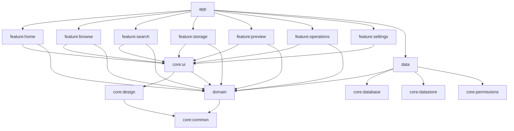

# Modules

## 1. Decision: single Gradle module for MVP

The brief proposes ~17 Gradle modules. That is the right end state for a large team and the
wrong starting point here.

**What multi-module actually buys you:** parallel compilation, enforced boundaries, and
independent testing. **What it costs:** ~17 build files, a version catalog per consumer, a
Hilt aggregation step per module, slower clean builds, and a lot of `api` vs `implementation`
decisions made before the boundaries are understood.

At MVP the codebase is roughly 15–20k lines. Incremental builds are a few seconds. The
parallelism win is negative.

**Therefore:** one `:app` module, with boundaries enforced at the **package** level by Lint
rules that are exactly as strict as module boundaries would be.

## 2. Package structure (MVP)

```text
com.devbehindyou.refract
├── RefractApp.kt                  // @HiltAndroidApp
├── MainActivity.kt                // single activity, enableEdgeToEdge
│
├── core
│   ├── common                     // Result, dispatchers, extensions, ByteSize, ClockProvider
│   ├── designsystem
│   │   ├── theme                  // colour, type, shape, spacing tokens
│   │   ├── glass                  // GlassTier, tokens, GlassSurface, AGSL shader, capability manager
│   │   └── component              // GlassButton, GlassSheet, LiquidBottomBar, ...
│   ├── ui                         // FileRow, StorageMeter, EmptyState, previews
│   ├── database                   // Room: entities, DAOs, RefractDatabase, migrations
│   ├── datastore                  // SettingsDataStore
│   └── navigation                 // routes, NavHost, deep links
│
├── domain                         // ⚠ NO android.* — Lint enforced
│   ├── model                      // FileNode, StorageVolume, FileOperation, FileError, ...
│   ├── repository                 // interfaces only
│   └── usecase
│
├── data
│   ├── repository                 // implementations
│   ├── backend                    // FileSystemBackend, SafBackend, MediaStoreBackend, selector
│   ├── operation                  // queue, executor, service
│   ├── archive                    // ZipHandler
│   ├── mapper                     // platform types -> domain models
│   └── permission                 // PermissionManager, StorageAccessManager
│
└── feature
    ├── home  ├── browse  ├── search  ├── storage
    ├── preview  ├── operations  ├── settings  └── permissions
```

Each `feature.x` contains: `XScreen.kt`, `XViewModel.kt`, `XUiState.kt`, `XEvent.kt`,
and a `component/` subpackage for screen-specific composables.

## 3. Enforced boundaries (Lint rules, build-failing)

| Rule | Detects |
|---|---|
| `NoAndroidInDomain` | Any `android.*`, `androidx.*`, or `java.io.File` import under `domain` |
| `NoPlatformFileInUi` | `java.io.File`, `Uri`, `ContentResolver`, `DocumentFile` under `feature.*` or `core.ui` |
| `NoFeatureCrossImport` | `feature.a` importing `feature.b` |
| `NoRawApiLevel` | A numeric literal compared against `Build.VERSION.SDK_INT` (must use a named constant) |
| `NoHardcodedDp` | `.dp` literal outside `core.designsystem` |
| `NoRunBlocking` | `runBlocking` outside `test`/`androidTest` |
| `NoGlobalScope` | `GlobalScope` anywhere |

These rules are the whole justification for skipping multi-module. If they are not written
in Phase 1, the architecture will erode.

## 4. When to split (V1 triggers)

Split when **any** of these becomes true, and split only along the line that the trigger
implies:

| Trigger | Split into |
|---|---|
| Incremental build > 90 s | `:core:designsystem`, `:core:ui` (they change least, are depended on most) |
| A second surface (widget, Wear, TV) | `:domain`, `:data` |
| A feature team forms | `:feature:x` per team |
| Baseline profile needs isolation | `:benchmark` (do this early regardless — it is a separate module by necessity) |

## 5. Target module graph (V1+, for reference)



Note that **no feature module depends on `data`** — only `:app` wires implementations to
interfaces. That is the property worth preserving, and it is achievable today with packages.

## 6. Build configuration

* Version catalog (`gradle/libs.versions.toml`) is the single source of dependency truth.
* Convention plugins live in `build-logic/` from day one, even with one module — they cost
  nothing and make the eventual split mechanical.
* `:benchmark` module exists from Phase 1 for the baseline profile.
