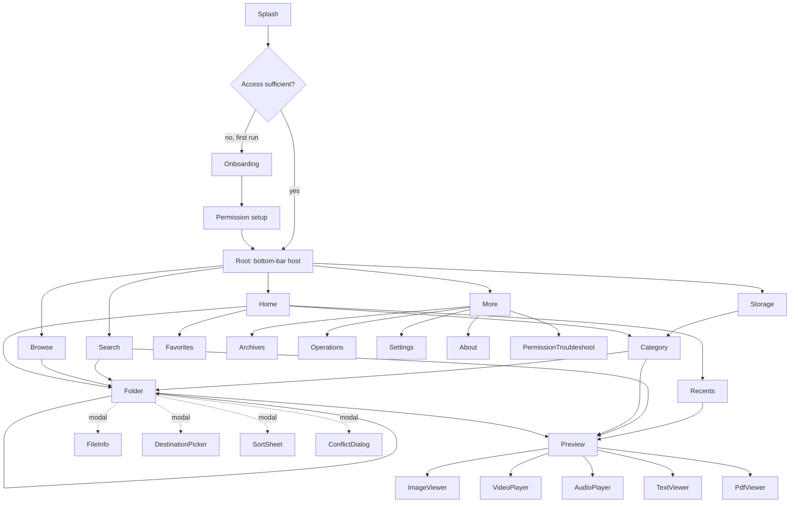

# Navigation Architecture

## 1. Graph



## 2. Type-safe routes

```kotlin
@Serializable data object HomeRoute
@Serializable data object BrowseRoute
@Serializable data class FolderRoute(val nodeId: String, val title: String? = null)
@Serializable data class SearchRoute(val initialQuery: String? = null, val scopeId: String? = null)
@Serializable data class CategoryRoute(val category: String)
@Serializable data class PreviewRoute(val nodeId: String, val siblingKey: String? = null)
@Serializable data object StorageRoute
@Serializable data object MoreRoute
@Serializable data object OperationsRoute
@Serializable data object SettingsRoute
```

Kotlin-serialization routes (Navigation Compose 2.8+) — no string building, no manual
argument encoding, compile-time safety.

## 3. Folder navigation

**`FolderRoute` is a single destination that recurses.** Each navigation pushes a new entry
with a different `nodeId`. This gives correct back behaviour for free and lets each level
keep its own scroll position via `SavedStateHandle`.

* Duplicate suppression: navigating to the folder already on top is a no-op
  (`launchSingleTop` plus an equality check on `nodeId`).
* Deep folder stacks are capped at 64 entries; beyond that the oldest are dropped and back
  from the bottom returns to Browse.
* The breadcrumb is derived from the **current node's ancestry**, not from the back stack —
  so arriving from Search shows the real path, and tapping an ancestor pops or pushes to
  reach it directly rather than re-walking.

## 4. Bottom-bar behaviour

```kotlin
navController.navigate(route) {
    popUpTo(navController.graph.findStartDestination().id) { saveState = true }
    launchSingleTop = true
    restoreState = true
}
```
* Each tab keeps its own back stack and scroll position.
* Tapping the active tab scrolls its content to the top; a second tap pops that tab's stack
  to its root.
* Back from a tab root goes to Home; back from Home exits.

## 5. Predictive back (mandatory at target 36)

* Every screen uses `PredictiveBackHandler` and drives its exit animation from the gesture
  progress — see `../ANIMATION_SYSTEM.md` §3.
* `onBackPressed()` is not used anywhere.
* Modal surfaces (sheets, dialogs, selection mode) consume back **before** navigation:
  1. Dismiss dialog
  2. Collapse sheet
  3. Exit selection mode
  4. Cancel search focus
  5. Navigate up
* The predictive-back preview shows the true destination, which is why the breadcrumb-derived
  ancestry matters — a wrong preview is worse than none.

## 6. Modal destinations

Bottom sheets and dialogs are **not** nav destinations by default; they are state within a
screen (`showSheet: SheetType?` in the UI state). Exceptions, which *are* destinations because
they must survive process death and be deep-linkable:

* `DestinationPicker` (choosing where to copy/move) — it can be deep in a folder tree
* `Operations`
* `PermissionTroubleshoot`

## 7. Deep links

| Link | Destination |
|---|---|
| `refract://folder?id={nodeId}` | Folder |
| `refract://search?q={query}` | Search |
| `refract://storage` | Storage |
| `refract://operations` | Operations (from the progress notification) |
| `ACTION_VIEW` + `content://` | Preview |
| `ACTION_GET_CONTENT` / `OPEN_DOCUMENT` | Picker mode (V1) |

Every deep link validates the target's existence and access before navigating, and falls
back to Home with a message rather than showing a broken screen.

## 8. State preservation

| Across | Preserved |
|---|---|
| Rotation | Everything (`SavedStateHandle` + `rememberSaveable`) |
| Process death | Route, path, query, filters, selection (≤ 500), sort, view mode |
| Tab switch | Each tab's full back stack and scroll |
| Fold/unfold | Everything, plus the list/detail pane assignment |
| App restart | Nothing except settings, favourites, trash and the operation queue |

## 9. Rules

1. One `NavHost`. One `NavController`. Held only by `MainActivity` and passed down as lambdas.
2. Never navigate from a ViewModel — emit an effect; the Route navigates.
3. Never pass a `FileNode` as an argument; pass the `nodeId` string and re-resolve.
4. Never create a second instance of a destination that is already on top.
5. Every destination handles its own back, and back never loses unsaved user intent without
   asking.
