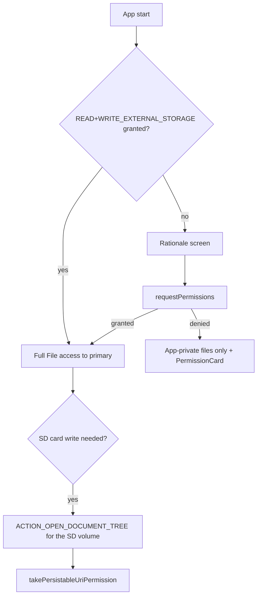
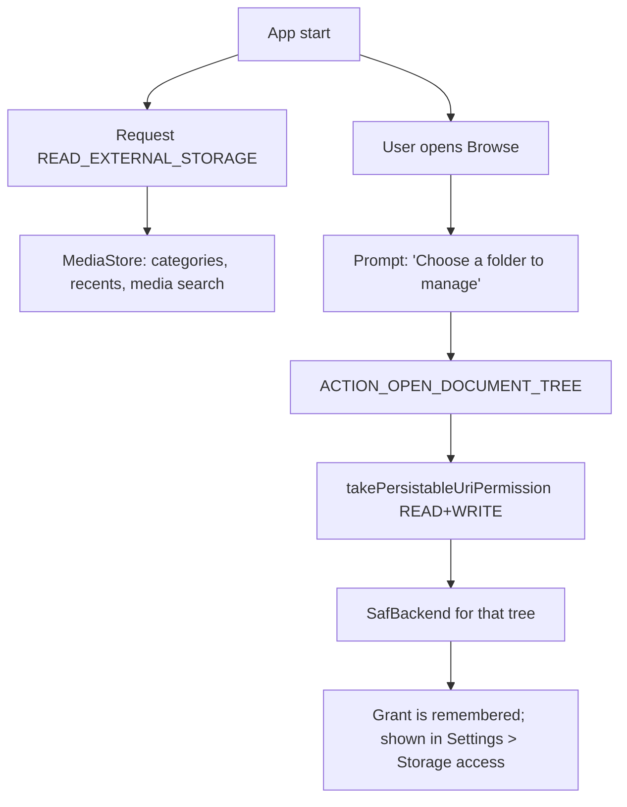
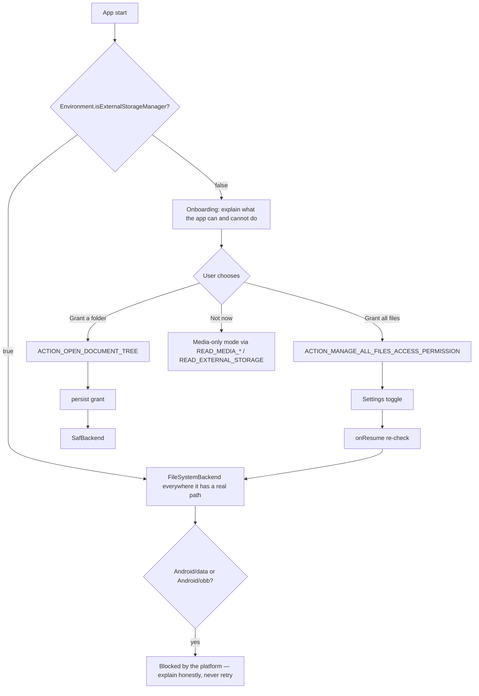

# Permission Architecture

Two classes, one rule: **nothing else in the app calls `requestPermissions` or checks
`SDK_INT` for storage access.**

```kotlin
/** Raw runtime permission plumbing. Knows nothing about storage semantics. */
interface PermissionManager {
    fun isGranted(permission: String): Boolean
    fun shouldShowRationale(permission: String): Boolean
    suspend fun request(vararg permissions: String): Map<String, Boolean>
}

/** Storage semantics. The only thing features talk to. */
interface StorageAccessManager {
    val state: StateFlow<StorageAccessState>
    fun requiredStepsFor(target: AccessTarget): List<AccessStep>
    suspend fun perform(step: AccessStep, launcher: ActivityResultLauncher<*>)
    fun hasAccessTo(volume: StorageVolumeInfo): Boolean
    fun hasAllFilesAccess(): Boolean
    fun persistedTreeGrants(): List<TreeGrant>
    fun refresh()
}

data class StorageAccessState(
    val level: AccessLevel,           // NONE, MEDIA_ONLY, PARTIAL_MEDIA, TREE_GRANTS, ALL_FILES
    val grantedVolumes: Set<String>,
    val canRequestAllFiles: Boolean,  // SDK_INT >= 30
    val notificationsAllowed: Boolean,
)
```

---

## 1. Flow by API level

### API 27–28 (Android 8.1, 9)



Notes: SD card **reads** usually work via `File`; **writes** need the tree grant. This has
been true since Lollipop and is OEM-variable. Probe with a temp write before claiming write
access.

### API 29 (Android 10)

The hardest version. `requestLegacyExternalStorage` is unavailable to us (we target 36).



The UI on API 29 must not present an "All files access" affordance — the permission does not
exist. It presents "Grant access to a folder" instead. Copy differs per API level and lives
in a single string resource set selected by `StorageAccessManager`.

### API 30+ (Android 11 → 17)



`isExternalStorageManager()` **must be re-checked in `onResume`**, because the user grants it
in Settings and returns; there is no result callback.

### API 33+ additions

* Replace `READ_EXTERNAL_STORAGE` with `READ_MEDIA_IMAGES` / `READ_MEDIA_VIDEO` /
  `READ_MEDIA_AUDIO`. Request only the ones the current action needs.
* `POST_NOTIFICATIONS` is requested **before the first background operation**, with the
  rationale "so we can show you copy progress" — never at launch.

### API 34+ additions

* `READ_MEDIA_VISUAL_USER_SELECTED`: the user may grant partial photo access. `AccessLevel`
  gains `PARTIAL_MEDIA`, and the Images category shows a "You've allowed access to selected
  photos — Manage" banner rather than pretending the library is empty.

---

## 2. Access levels and what each unlocks

| Level | Reached by | Browse shared storage | Write shared | Categories | Search all |
|---|---|---|---|---|---|
| `NONE` | Nothing granted | app-private only | app-private | ✗ | app-private |
| `MEDIA_ONLY` | `READ_MEDIA_*` / `READ_EXTERNAL_STORAGE` | via MediaStore | ✗ | ✓ | media only |
| `PARTIAL_MEDIA` | API 34 selected photos | selected items | ✗ | partial + banner | partial |
| `TREE_GRANTS` | SAF tree URIs | granted trees | granted trees | ✓ (+media) | granted trees |
| `ALL_FILES` | `MANAGE_EXTERNAL_STORAGE` | ✓ (not `/Android/data|obb`) | ✓ | ✓ | ✓ |

**Every level is usable.** The app never dead-ends. `AccessLevel.NONE` still shows the
app's own files, Settings, and a clear route to more.

---

## 3. Rationale screens

Rules, all mandatory:

1. Explain the **benefit**, not the permission. "See every file on your phone" beats
   "This app needs MANAGE_EXTERNAL_STORAGE".
2. State the **limit** in the same breath: "Android still blocks app data folders — no app
   can open those."
3. Offer a **lesser option** of equal visual weight ("Choose a folder instead").
4. Never show the rationale twice in a row after a denial. Show it once, then a
   `PermissionCard` inline.
5. After two denials, stop asking. Access lives in Settings → Storage access from then on.

## 4. Persisting SAF grants

```kotlin
contentResolver.takePersistableUriPermission(
    treeUri,
    Intent.FLAG_GRANT_READ_URI_PERMISSION or Intent.FLAG_GRANT_WRITE_URI_PERMISSION,
)
```

* Grants are enumerated at start via `contentResolver.persistedUriPermissions` and reconciled
  against known volumes. A grant whose volume is gone is shown as "unavailable", not deleted —
  the SD card may come back.
* Grants are surfaced in **Settings → Storage access**, each with a Revoke action calling
  `releasePersistableUriPermission`.
* There is a system cap on persisted grants (historically ~128, **[device-variable]**);
  we never request a tree per folder — one per volume, plus explicit user choices.

## 5. Revocation and loss

| Event | Detection | Response |
|---|---|---|
| Permission revoked in Settings while backgrounded | `onResume` re-check | Update `StorageAccessState`, show an inline card, cancel affected operations |
| Auto-revoke after months unused (API 30+) | Same | Same; also `setAutoRevokeWhitelisted` is **not** requested — we accept auto-revoke |
| SAF grant lost (provider reset) | `SecurityException` from the backend, mapped to `AccessDenied` | Mark the volume as requiring a grant, offer re-grant |
| Volume unmounted | Mount broadcast | Volume marked unavailable, operations cancelled cleanly |

Never crash. Never silently show an empty folder.

## 6. Notification permission

* Requested lazily, at the first operation that would run in the background.
* If denied: operations still run in the foreground service, but the service posts a
  minimal-importance notification (required by the platform) and the app relies on the
  in-app operation pill. The user is told once that progress will only be visible in-app.

## 7. Google Play declaration checklist

Before submitting a build declaring `MANAGE_EXTERNAL_STORAGE`:

- [ ] The store listing's first paragraph states that the app manages files across device storage
- [ ] A screenshot shows browsing and file operations
- [ ] The Permissions Declaration Form is completed, selecting the file-manager permitted use
- [ ] A demo video shows the core flow that requires the permission
- [ ] The app works, visibly, without the permission (reviewers test this)
- [ ] The in-app rationale is reachable and honest
- [ ] `requestLegacyExternalStorage` is **absent** from the manifest
- [ ] Data Safety form matches `../PRIVACY.md`

## 8. Manifest

```xml
<uses-permission android:name="android.permission.READ_EXTERNAL_STORAGE"
    android:maxSdkVersion="32" />
<uses-permission android:name="android.permission.WRITE_EXTERNAL_STORAGE"
    android:maxSdkVersion="28" />
<uses-permission android:name="android.permission.READ_MEDIA_IMAGES" />
<uses-permission android:name="android.permission.READ_MEDIA_VIDEO" />
<uses-permission android:name="android.permission.READ_MEDIA_AUDIO" />
<uses-permission android:name="android.permission.READ_MEDIA_VISUAL_USER_SELECTED" />
<uses-permission android:name="android.permission.MANAGE_EXTERNAL_STORAGE"
    tools:ignore="ScopedStorage" />
<uses-permission android:name="android.permission.POST_NOTIFICATIONS" />
<uses-permission android:name="android.permission.FOREGROUND_SERVICE" />
<uses-permission android:name="android.permission.FOREGROUND_SERVICE_DATA_SYNC" />
```

No `INTERNET` in the base flavour.
