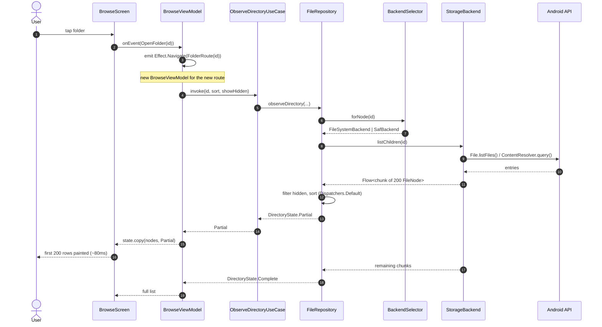
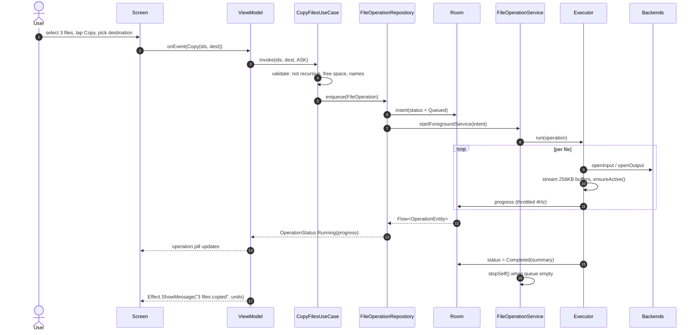
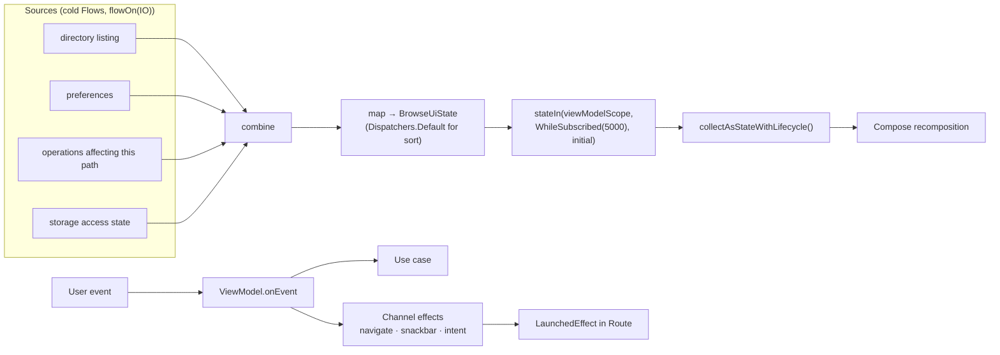

# Data Flow

## 1. Read path — opening a folder

## 2. Write path — copying files

## 3. State flow within a screen

## 4. Rules encoded here

* Reads are **streams**, not one-shot calls, so the UI paints before data is complete.
* Writes are **enqueued**, never executed inline, so they survive the screen.
* Progress travels **through Room**, not through a direct callback, so it survives process
  death and any observer can see it.
* Effects use a `Channel`, so no navigation or snackbar is duplicated on recomposition or
  lost on rotation.
