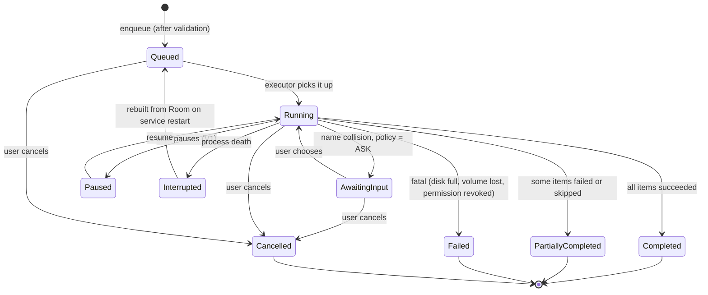
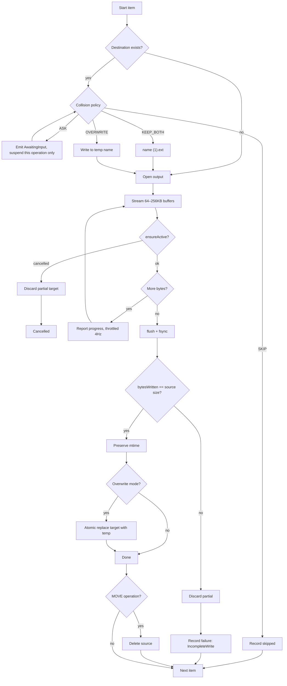
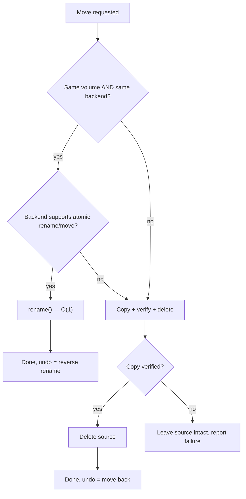
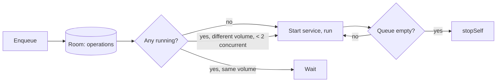
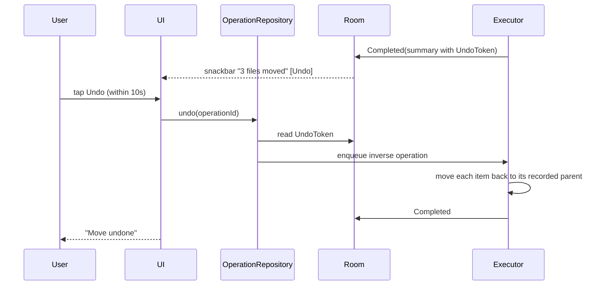

# File Operation Flow

## 1. Operation state machine

`Interrupted` is explicit. An operation killed by the system is never reported as
completed and never silently vanishes.

## 2. Copy of a single file

The two guards that prevent data loss: **discard partial on any failure**, and
**never delete the source before the copy is byte-verified**.

## 3. Move decision

## 4. Queue behaviour

## 5. Undo

Undo is itself a normal operation: queued, progressed, cancellable, and logged. It is not a
special-cased shortcut, which is why it works for 5,000 files as well as for 3.
