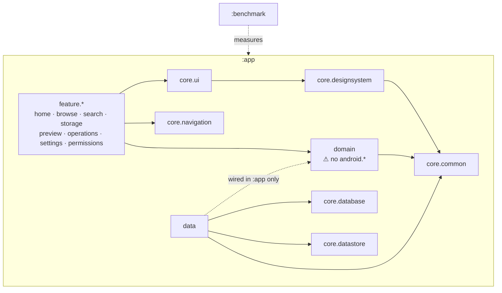
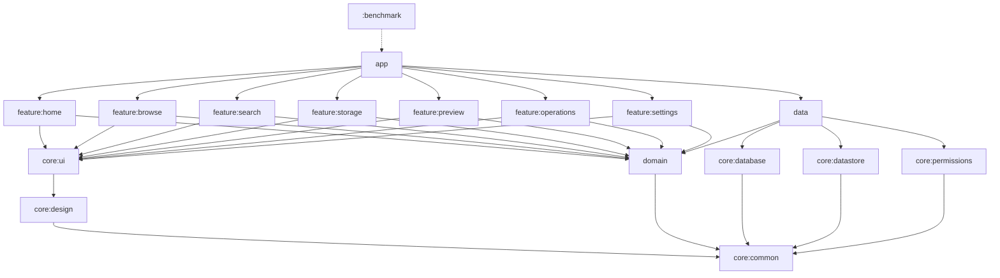

# Module and Package Dependencies

## MVP — one Gradle module, enforced package boundaries

**The invariant worth protecting:** `feature.*` never imports `data`. Features depend on
`domain` interfaces; Hilt binds implementations in `:app`. This is what makes the eventual
module split mechanical rather than a refactor.

## Allowed dependencies

| From | May depend on |
|---|---|
| `feature.*` | `domain`, `core.ui`, `core.designsystem`, `core.navigation`, `core.common` |
| `core.ui` | `core.designsystem`, `core.common`, `domain` (models only) |
| `core.designsystem` | `core.common` |
| `domain` | `core.common`, Kotlin, coroutines |
| `data` | `domain`, `core.database`, `core.datastore`, `core.common`, Android |
| `core.database` / `core.datastore` | `core.common` |
| `core.common` | nothing |

## Forbidden (Lint-enforced, build-failing)

* `domain` → anything Android
* `feature.a` → `feature.b`
* `feature.*` → `data`
* `core.designsystem` → `domain` business models
* Any cycle whatsoever

## V1 — Gradle module split

Split triggers are listed in `MODULES.md` §4. Do not split before one fires.
