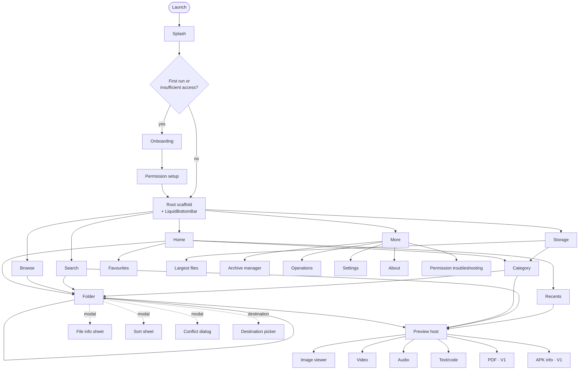
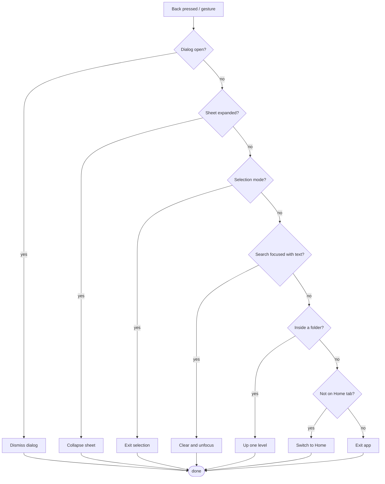
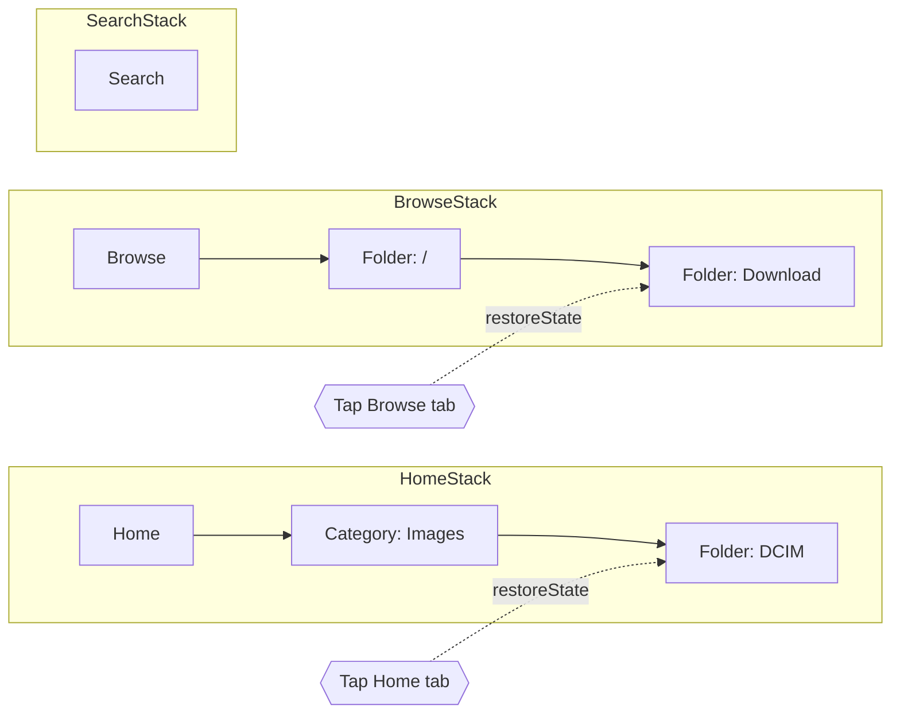

# Navigation Flow

Full route graph, back behaviour, and predictive-back handling.
The authoritative rules live in `NAVIGATION.md`; this file is the picture.

## 1. Route graph

## 2. Back priority

Predictive back previews whichever destination this chain resolves to, so the preview is
always truthful.

## 3. Tab back stacks

Each tab keeps its own stack and scroll position. Switching tabs never resets the other tab.
