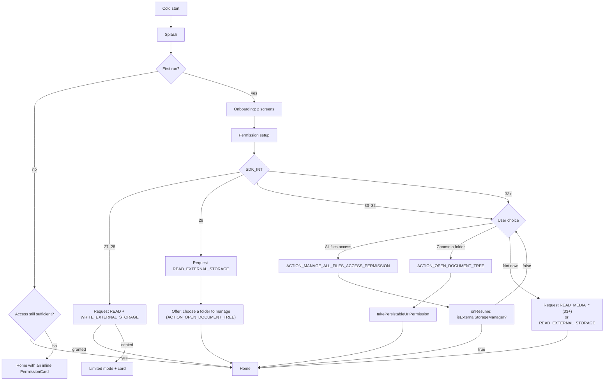
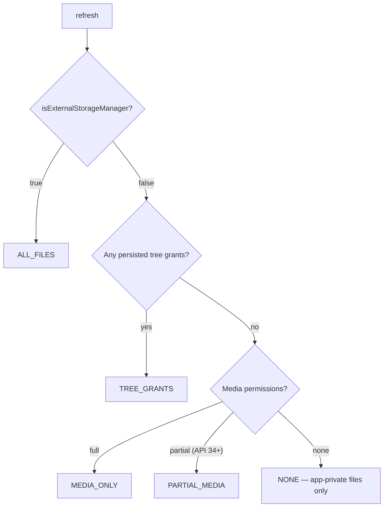
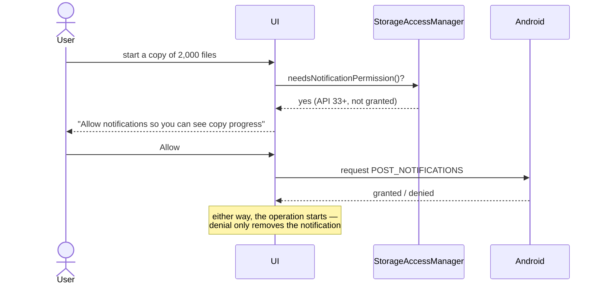
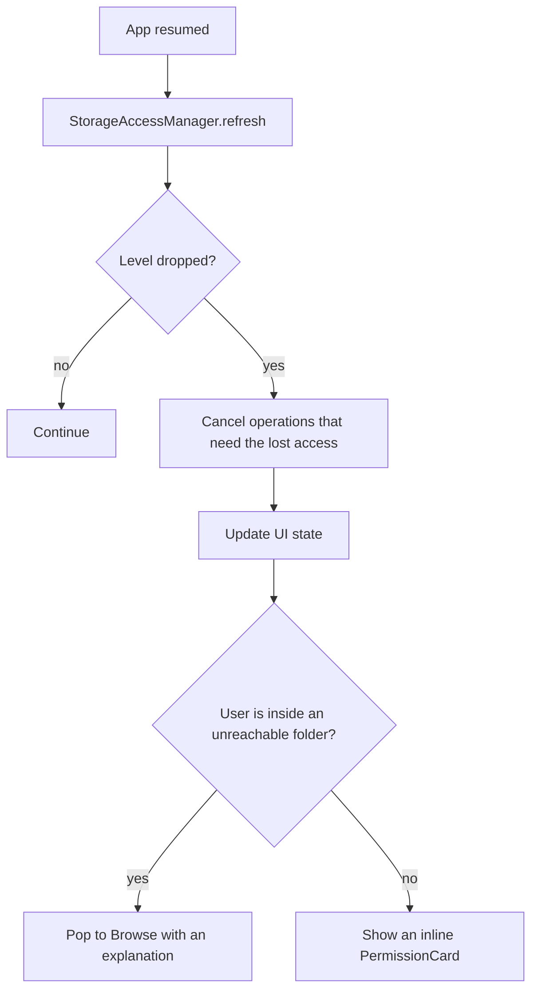

# Permission Flow

## 1. First launch

## 2. Access level resolution

Every level renders a working app. `NONE` shows app-private files, Settings, and a route to
more access — never an error screen.

## 3. Notification permission, requested lazily

## 4. Revocation while running

## 5. The honest-limits rule

Whenever the user tries to reach `/Android/data` or `/Android/obb` on API 30+, the app shows:

> **Android blocks this folder**
> Since Android 11, no file manager can open app data folders. This is a system restriction,
> not a limitation of Refract.

and offers no retry button. Pretending otherwise generates support load and one-star reviews.
