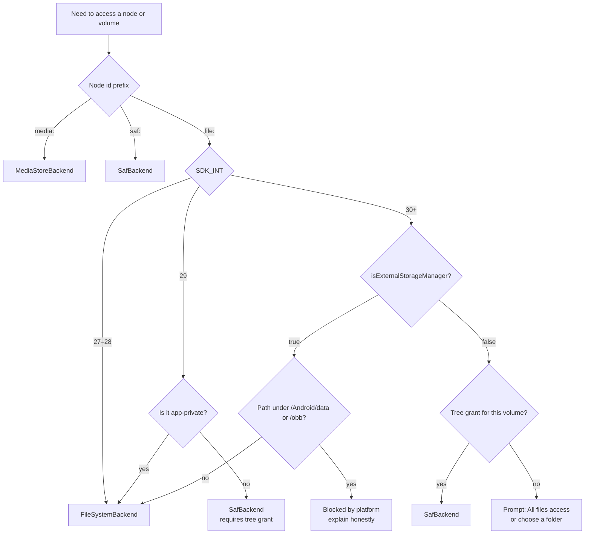
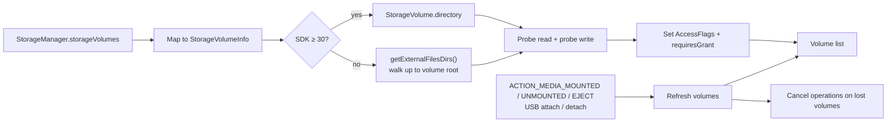
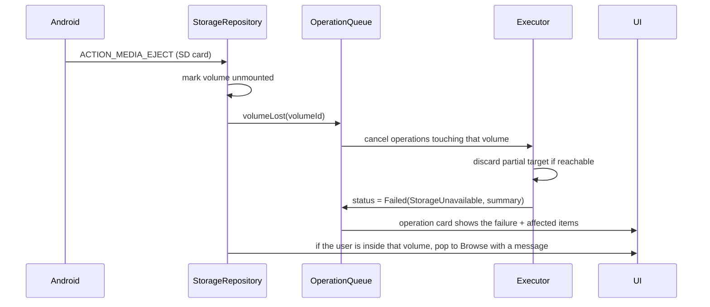

# Storage Access Flow

## 1. Backend selection at runtime

## 2. Volume discovery

## 3. What happens when a volume disappears mid-operation

No crash, no partial file with a final name, no silent loss.
