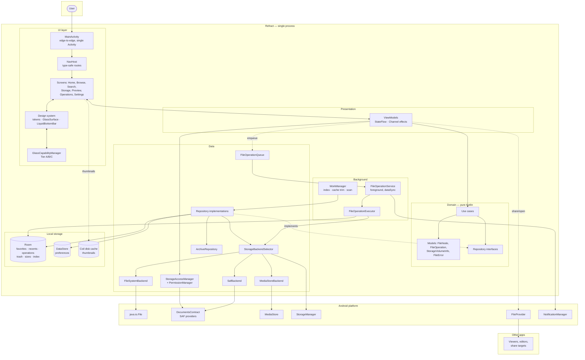

# System Architecture Diagram

## Key properties this diagram encodes

1. **Only the data layer touches Android storage APIs.** No arrow crosses from UI or Domain
   to the platform box.
2. **Domain has no outgoing arrows** except to its own models. It is a JVM-testable island.
3. **The executor is reached through the queue, not directly.** A ViewModel cannot start a
   file operation synchronously — it can only enqueue one.
4. **Room is the source of truth for operation state**, which is what allows the queue to
   survive process death.
5. **`GlassCapabilityManager` is a UI-layer concern only.** Nothing below the design system
   knows the app has glass.
