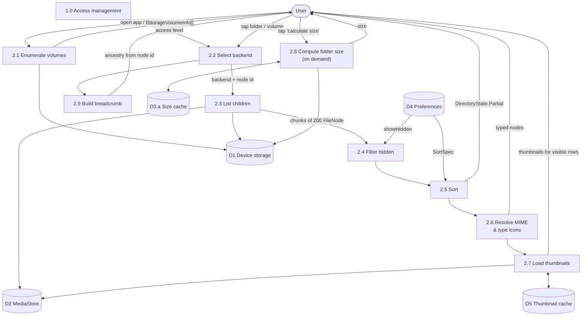
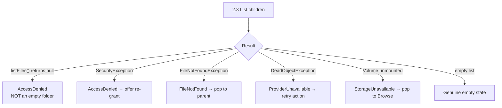

# DFD — File Browsing (Process 2.0 expanded)

## Timing

| Stage | Target | Note |
|---|---|---|
| 2.1 volumes | < 50 ms | Cached after first call, refreshed on mount events |
| 2.2 backend selection | < 1 ms | Pure decision, no I/O |
| 2.3 first chunk | < 80 ms | 200 entries |
| 2.4 + 2.5 | < 20 ms per chunk | On `Dispatchers.Default` |
| 2.6 MIME | < 5 ms | Extension map first; content sniffing only when unknown and the file is small |
| 2.7 thumbnails | < 120 ms per visible item | Off the critical path entirely |
| 2.8 folder size | unbounded, cancellable | Never on the critical path; user-triggered |
| 2.9 breadcrumb | < 5 ms | Derived from ancestry, not the back stack |

## Failure paths

The `null`-vs-empty distinction is the single most important error case in this diagram:
rendering "This folder is empty" when access was actually denied is the bug users report as
"the app deleted my files".
