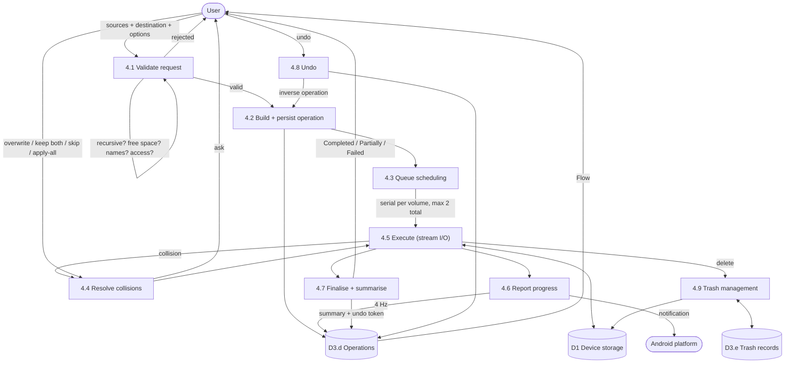
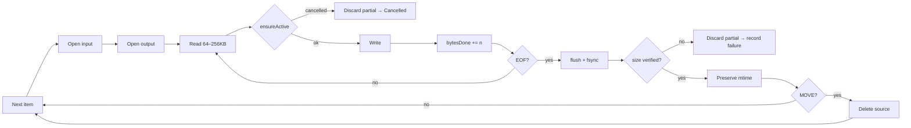
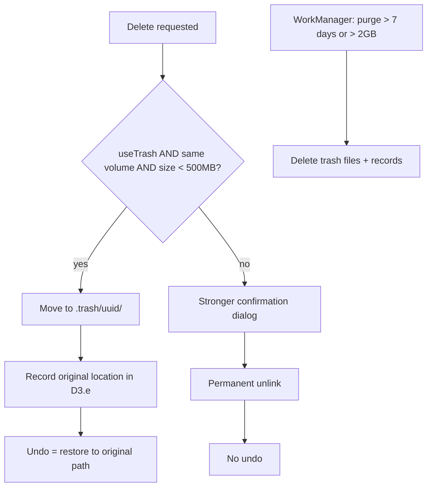

# DFD — File Operation (Process 4.0 expanded)



## Validation gate (4.1) — everything checked before anything happens

| Check | Failure |
|---|---|
| Sources non-empty | `NothingSelected` |
| Destination is not a source or a descendant of one | `InvalidDestination` |
| Destination is writable (`AccessFlags`) | `AccessDenied` |
| Free space > total × 1.02 | `DiskFull` |
| Names legal for the destination filesystem | sanitise + confirm |
| Not targeting `/Android/data` or `/obb` on API 30+ | `PlatformRestricted` |
| Destination volume mounted | `StorageUnavailable` |

## Execution loop (4.5)



## Progress data (4.6)

```text
itemsDone / itemsTotal
bytesDone / bytesTotal          (bytesTotal may start unknown and resolve mid-run)
currentName
bytesPerSecond                  (rolling 3-second average, not instantaneous)
etaMillis                       (null until 5% or 3 seconds have elapsed)
```

ETA is deliberately withheld early — an ETA that says "4 hours" for two seconds and then
"12 seconds" is worse than no ETA.

## Trash (4.9)


