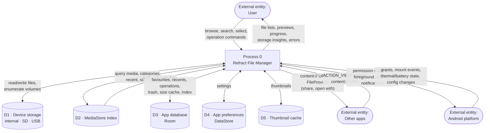

# DFD Level 0 — Context Diagram

The whole app as one process, with its external entities and data stores.

## External entities

| Entity | Gives Refract | Receives from Refract |
|---|---|---|
| **User** | Navigation, selections, queries, operation commands, permission decisions | File listings, previews, progress, storage analysis, errors |
| **Other apps** | Incoming view/share intents with `content://` URIs | Outgoing `content://` URIs with least-privilege grants |
| **Android platform** | Permission results, storage mount events, thermal/battery/accessibility state | Permission requests, service lifecycle, notifications |

## Data stores

| Store | Owner | Persistence |
|---|---|---|
| **D1 Device storage** | The user | Permanent — the thing being managed |
| **D2 MediaStore** | Android | System-owned index; read-mostly for us |
| **D3 Room** | Refract | App-private; survives restart, cleared on uninstall |
| **D4 DataStore** | Refract | App-private settings |
| **D5 Thumbnail cache** | Refract (Coil) | App cache dir; evictable by the system |

## Trust boundaries

* **D1 content is untrusted.** Filenames, archive entries and file contents come from the
  outside world and are validated (`architecture/SECURITY.md`).
* **Incoming intents are untrusted.** URIs are validated; paths from external callers are
  never resolved directly.
* **D3/D4/D5 are app-private** and never contain file contents.
* **Nothing crosses a network boundary.** There is no network external entity on this
  diagram, and that is the whole point of `PRIVACY.md`.
