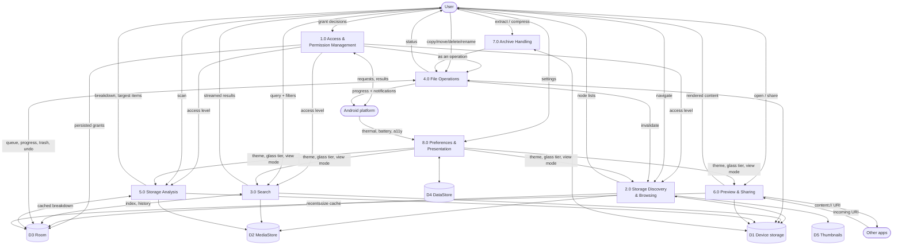

# DFD Level 1 — Major Processes

## Process responsibilities

| # | Process | Inputs | Outputs | Key stores |
|---|---|---|---|---|
| 1.0 | Access & permissions | User decisions, platform grants | `AccessLevel`, tree grants | D3 |
| 2.0 | Storage discovery & browsing | Path, sort, filters, access level | Node lists, breadcrumb, volumes | D1, D2, D3, D5 |
| 3.0 | Search | Query, filters, scope | Ranked, deduplicated results | D1, D2, D3 |
| 4.0 | File operations | Sources, destination, options | Progress, summary, undo token | D1, D3 |
| 5.0 | Storage analysis | Volume, scan trigger | Category breakdown, top-N | D1, D2, D3 |
| 6.0 | Preview & sharing | Node id | Rendered content, share intents | D1, D3 |
| 7.0 | Archives | Archive node, selection, destination | Extracted tree / new archive | D1 |
| 8.0 | Preferences & presentation | Settings, platform state | Theme, glass tier, defaults | D4 |

## Cross-cutting flows worth noticing

* **1.0 gates 2.0–5.0.** No process reads storage without consulting the access level first.
* **7.0 delegates to 4.0.** Archive work is executed by the operations engine so it inherits
  progress, cancellation, collision handling and the foreground service — rather than
  reimplementing them.
* **4.0 invalidates 2.0.** Completing an operation refreshes the affected directory listing;
  this is the reliable refresh path, since file watching is not dependable.
* **8.0 feeds presentation only.** No preference changes what is *possible*, only what is
  *shown* — except `showHidden` and `indexEnabled`, which are filters, not capabilities.
