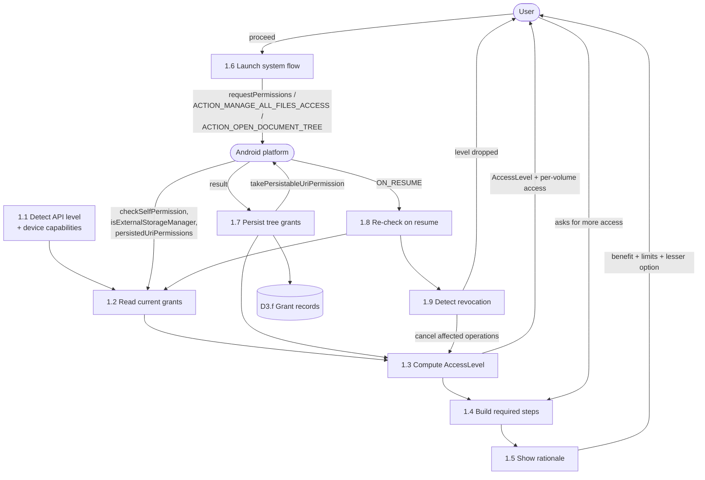

# DFD — Permissions (Process 1.0 expanded)



## Step model

```kotlin
sealed interface AccessStep {
    data class RuntimePermissions(val permissions: List<String>) : AccessStep
    data object AllFilesAccess : AccessStep                       // API 30+
    data class TreeGrant(val volumeId: String) : AccessStep
    data object NotificationPermission : AccessStep               // API 33+
}
```

`requiredStepsFor(target)` returns an **ordered** list for the current API level. The UI
walks it; no screen contains its own `SDK_INT` branch.

| Target | API 27–28 | API 29 | API 30–32 | API 33+ |
|---|---|---|---|---|
| Browse primary shared | `RuntimePermissions(R,W)` | `RuntimePermissions(R)` + `TreeGrant` | `AllFilesAccess` \| `TreeGrant` | `AllFilesAccess` \| `TreeGrant` \| `RuntimePermissions(media)` |
| Browse SD card | `TreeGrant` | `TreeGrant` | `AllFilesAccess` \| `TreeGrant` | same |
| Categories only | `RuntimePermissions(R)` | `RuntimePermissions(R)` | `RuntimePermissions(R)` | `RuntimePermissions(media)` |
| Background operation | — | — | — | `NotificationPermission` |

## Rationale rules (1.5)

1. Explain the benefit, not the permission name.
2. State the limitation in the same view.
3. Offer a lesser alternative with equal visual weight.
4. Never repeat immediately after a denial.
5. After two denials, route through Settings only.

## Revocation detection (1.9)

| Signal | Meaning |
|---|---|
| `checkSelfPermission` changed on resume | Runtime permission revoked |
| `isExternalStorageManager()` false when it was true | All Files Access revoked |
| `persistedUriPermissions` missing an entry | SAF grant lost |
| `SecurityException` from a backend | Grant lost since the last check — refresh immediately |

Response is always the same shape: update state, cancel affected operations, tell the user
what changed and how to fix it, never crash.
