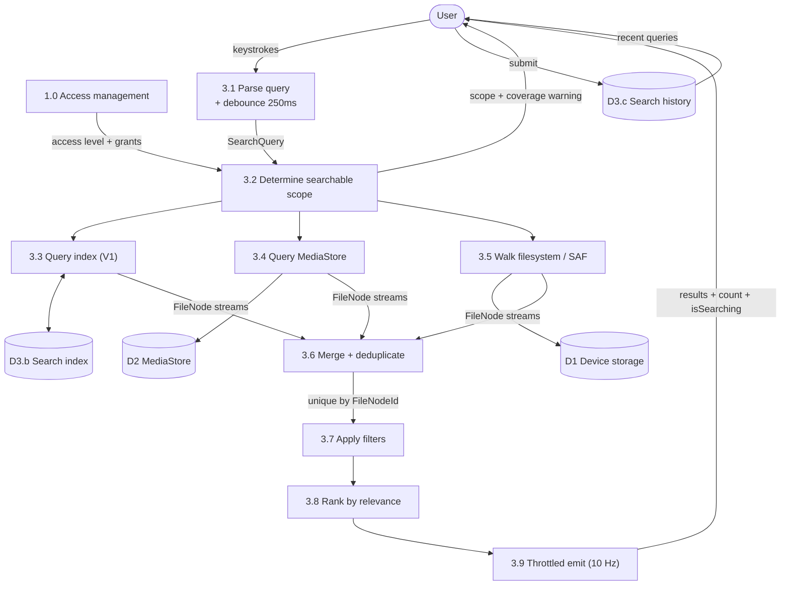
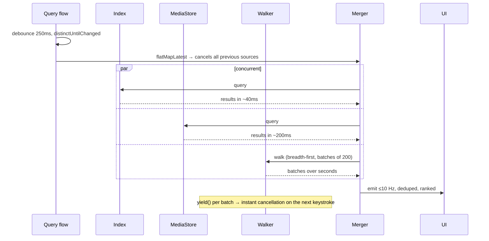

# DFD — Search (Process 3.0 expanded)

## Concurrency

## Coverage honesty

`3.2` produces a `CoverageWarning` whenever the searchable scope is narrower than what the
user asked for:

| Situation | Warning shown |
|---|---|
| API 29, no tree grants | "Search covers media and folders you've allowed. Add a folder." |
| API 30+, no All Files Access | Same, with an "Allow all files" action |
| Partial media grant (API 34+) | "Only selected photos are searchable. Manage selection." |
| Volume unmounted | "SD card isn't available." |

The scope chip always reflects reality. It never says "All storage" when it means "the two
folders you granted".

## Termination

* Walk stops at depth 32, at 5,000 results, on cancellation, or on completion.
* Reaching the result cap shows "Showing the first 5,000 — refine your search", never a
  silent truncation.
