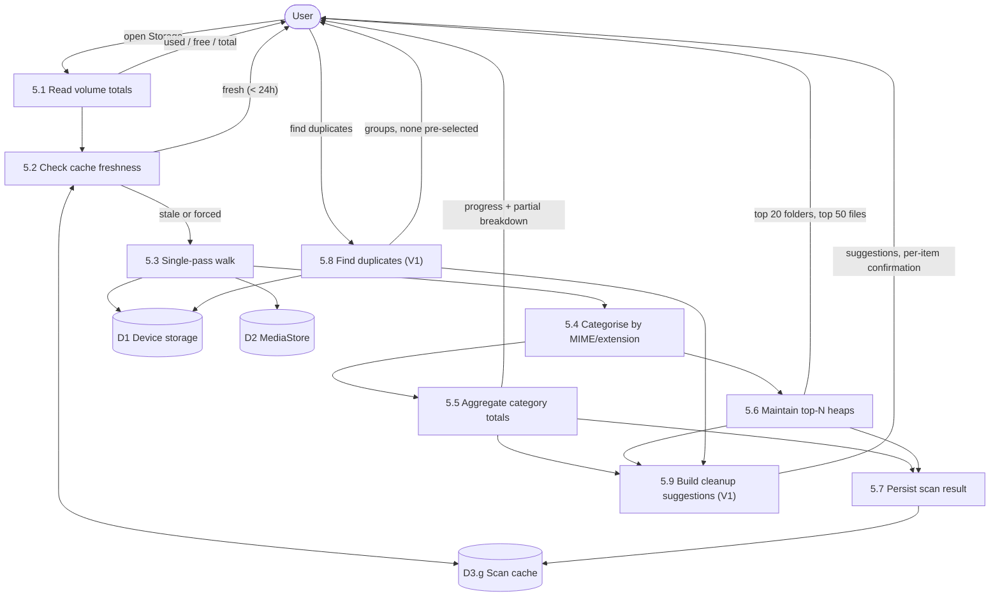
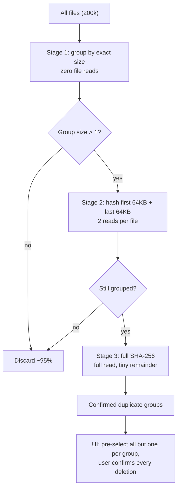

# DFD — Storage Analysis (Process 5.0 expanded)



## Why a single pass

Three separate walks (categories, largest files, largest folders) would triple the I/O on a
200,000-file volume. One walk feeds all three aggregators:

```kotlin
walk(root) { node ->
    categoryTotals.merge(node.category, node.size, Long::plus)
    largestFiles.offer(node)                       // bounded min-heap, size 50
    folderAccumulator.add(node.parentId, node.size)
}
// top folders derived from folderAccumulator at the end, also via a bounded heap
```

Bounded heaps mean memory is O(N) in the *result* size, not the file count.

## Duplicate detection (V1) — three stages



**Safety rule:** never auto-select every copy in a group, and never delete without explicit
confirmation. The failure mode here is destroying someone's only copy of a photo.

## Progress and cancellation

* Progress is reported per top-level directory so the bar advances meaningfully rather than
  sitting at 3% for a minute.
* Cancellable at every directory boundary; a cancelled scan keeps its partial results and
  labels them as partial.
* Runs at background thread priority; never blocks browsing.
* Results are shown from cache instantly with a "Scanned 2 hours ago · Rescan" affordance.

## Visualisation constraint

The output is rendered as **one horizontal stacked bar plus a legend** — not a pie, donut, or
treemap. Length comparison beats angle comparison for accuracy, and the stacked bar scales
down to a 320dp screen without becoming unreadable. See `../COMPONENT_LIBRARY.md`
(`StorageMeter`).
